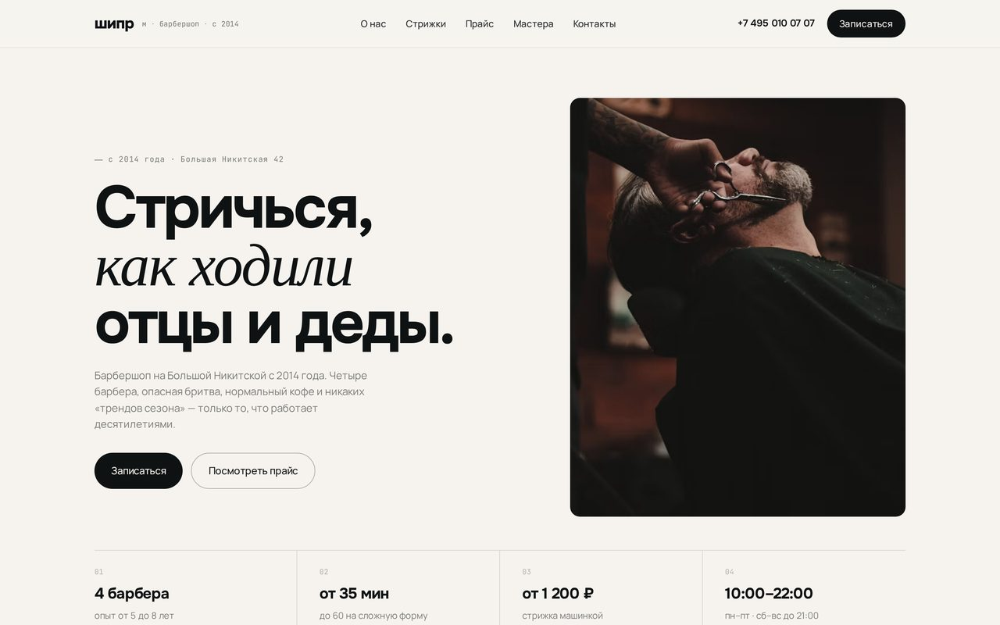

# ШИПР — сайт барбершопа

🔗 Демо: https://shipr-nu.vercel.app



## О проекте

Одностраничник барбершопа с лицом старого плаката. Не глянцевый барбер из ТЦ, а классический мужской салон «с опасной бритвой». Тёпло-чёрный фон, охра, плакатный Anton — настроение считывается сразу. Бренд вымышленный, но бриф боевой: привести на запись.

Запись стоит прямо на первом экране — имя, телефон с маской под российский формат, проверка по ходу ввода, после отправки подтверждение. Дальше длинная атмосферная лента: преимущества, рассказ о салоне, табы с типами стрижек, прайс свёрстан как кассовый чек, разворот «Стрижка / Бритьё» на два фото, команда, цифры, галерея. Между секциями крутится красно-сине-белая barber pole, собранная на чистом CSS.

## Структура проекта

```
shipr/
├── index.html      # вся разметка: hero с формой записи, секции, прайс-чек, команда, галерея
├── styles.css      # стили: палитра, плакатная типографика Anton, barber pole на CSS, адаптив
├── app.js          # вся интерактивность (см. ниже)
└── preview.jpg     # скриншот для превью
```

## Как это работает

Никаких библиотек — весь оживляж написан руками в `app.js`:

- **Форма записи** — телефон с маской под российский формат (`+7 (___) ___-__-__`), валидация по ходу ввода, после отправки — экран подтверждения.
- **Заголовки** — набираются побуквенно при появлении в зоне видимости.
- **Цитата** — печатается как на печатной машинке (typewriter).
- **Имена мастеров** — при наведении буквы перемешиваются (scramble-эффект).
- **Табы** типов стрижек переключают контент без перезагрузки.
- **Barber pole** — крутящаяся красно-сине-белая спираль собрана на чистом CSS (градиент + анимация), без картинок и JS.

## Стек

HTML / CSS / нативный JS, **без зависимостей**. Все анимации — руками. Шрифт **Anton** (Google Fonts).

## Запуск и деплой

Открыть `index.html`, либо:

```bash
python -m http.server 8000
# http://localhost:8000
```

Деплой — статикой на Vercel.
